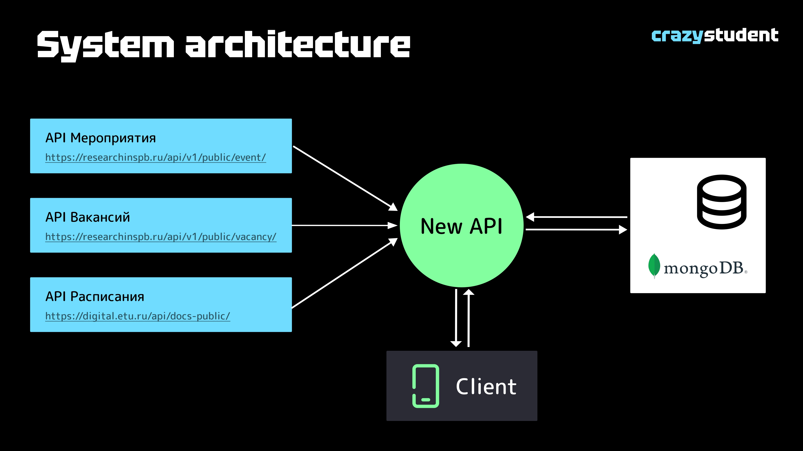
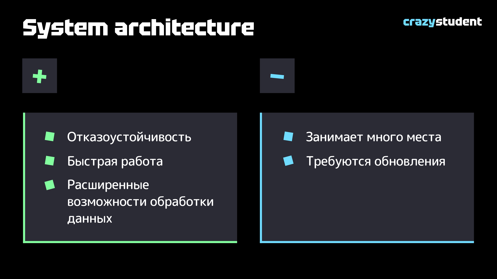
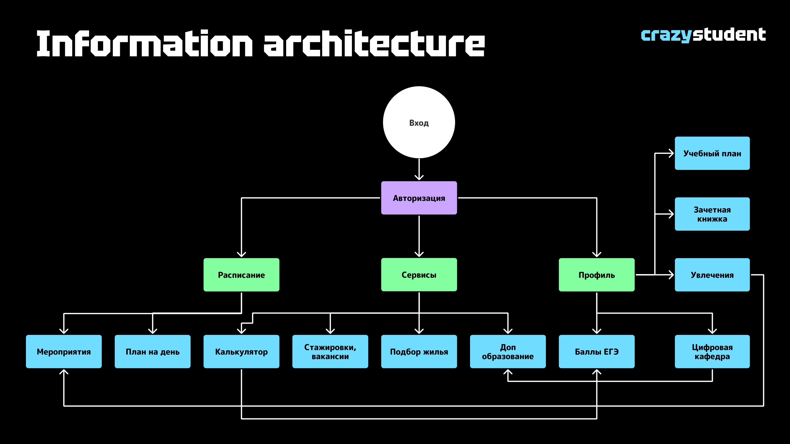
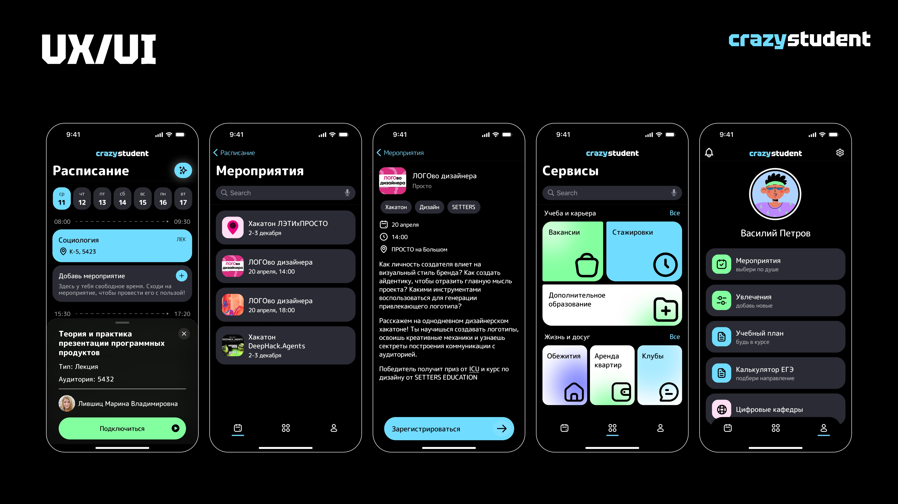
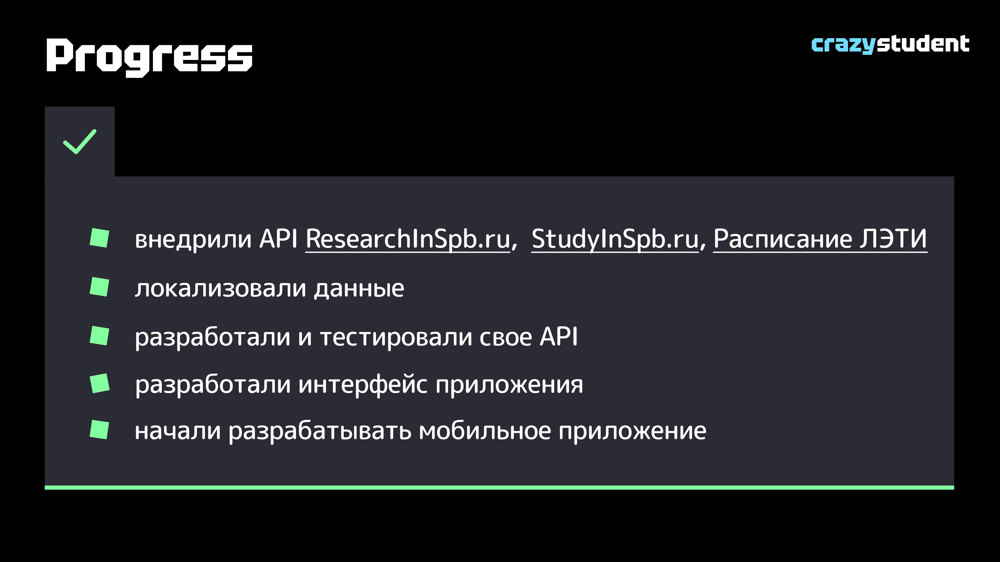
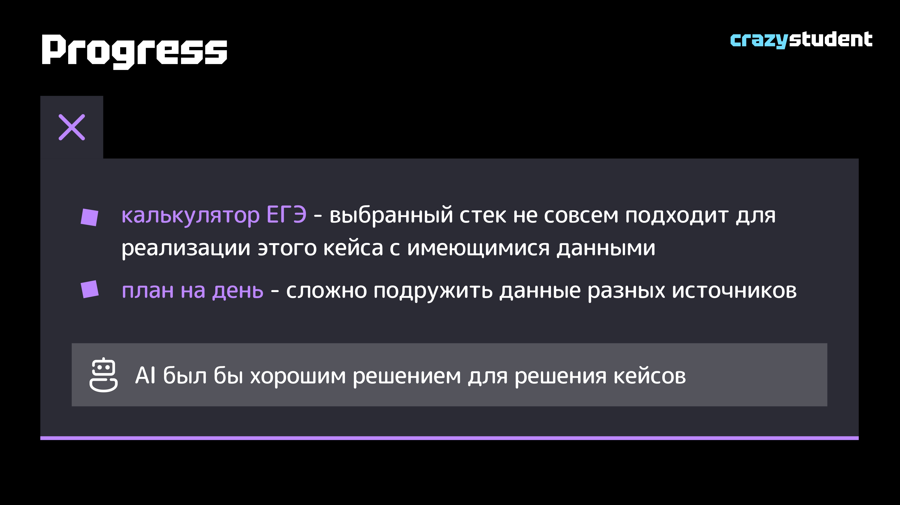
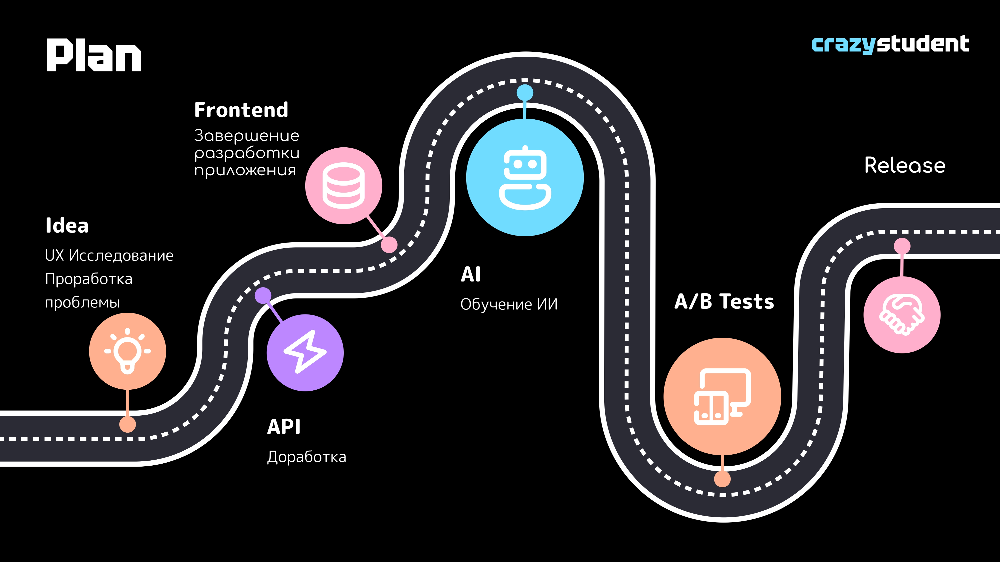

# Марафон "Цифровой Петербург"

В рамках данного хакатона была разработана серверная часть для мобильного приложения, которое рекомендует разнообразные события:
образовательные, научные, досуговые и бытовые.
---
[Сертификат участника](other/Sertifikat_Tsifrovoy_Peterburg_servis_68.pdf) \
[Полная презентация продукта](other/letiXProsto.pdf)
---
### Технологический стек:
* Java 17
* Spring boot 2.5.6
* Spring data JPA
* Ktor 2.3.10
* Kotlin 1.9.23
* Gradle 1.9.0
* MongoDB
---

  

  

  

  

  

  

  

  

  

---